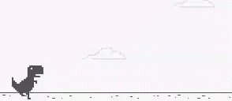

<h1 align="left">Hello! 👋</h1>

###

<b>Im Ram</b>

<b>Full Stack Developer & Deep Learning Enthusiast</b>

###
## About me

## About me

✨ Creating bugs since my first "Hello World" 
📚 Currently learning AI, Deep Learning & scalable full-stack systems 
🎯 Goals: Build intelligent, real-world software 
🎲 Fun fact: I enjoy turning ML ideas into practical products

  

###

<h2 align="left">🛠️ Tech Stack</h2>

<!-- MERN Badge -->

  

<h2 align="left">🛠️ Tech Stack</h2>

  

  
  
  
  
  
  
  
  
  
  
  

###

<h2 align="left">📊 GitHub Stats</h2>

  

###

